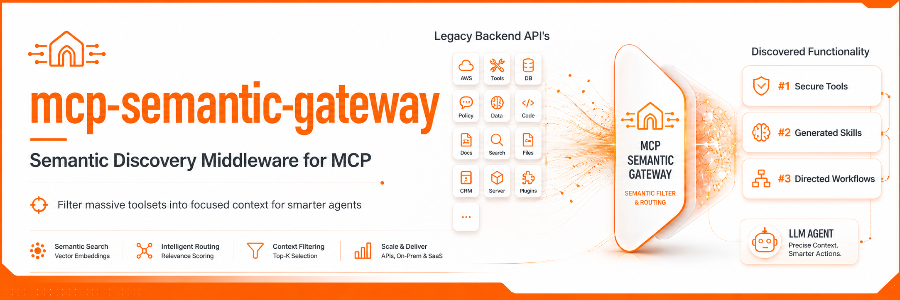

<p align="center">
  
</p>

<h1 align="center">MCP Semantic Gateway</h1>

<p align="center">
  <strong>One gateway. Every API. Any agent.</strong><br>
  Plug your legacy stack, your SaaS APIs, and your MCP servers into a single
  semantic catalog — and let agents discover the exact tools, skills, and
  workflows they need, on demand.
</p>

<p align="center">
  <a href="https://pypi.org/project/mcp-semantic-gateway/"></a>
  <a href="LICENSE"></a>
  <a href="#"></a>
</p>

---

## Why this exists

Modern agents are drowning in tools. A single workspace can fan out to GitHub,
Slack, Jira, Stripe, an internal billing API, three OpenAPI specs from your
platform team, and a handful of MCP servers — and every one of them dumps its
full tool list into the model's context on every turn. The result: hallucinated
tool calls, eye-watering token bills, and a model that can't see the wood for
the trees.

**MCP Semantic Gateway is the one place you point everything.** Native MCP
servers, OpenAPI/Swagger specs from your legacy backends, hand-authored
skills, *and* skills it auto-generates from your tool catalogs — all unified
behind a single MCP endpoint. Agents query it semantically: *"refund a
customer's last order"* returns the three tools and the workflow that
actually does that, not 400 unrelated definitions.

It's the **universal adapter** between your existing infrastructure and a modern AI stack.

---

## The three things it does

### 1. Semantic Tool Search for MCP
Point any MCP-speaking client at the gateway. It harvests tools from every
upstream you configure, creates a semantic understanding of the tools, and 
serves only the top matches for the current task. `tools/call` requests are 
transparently routed back to the correct upstream with all authentication in 
tact. 

### 2. Auto-Generated Skills & Use Case Discovery
Tool descriptions tell an agent *what `createOrder` does*. They don't tell it
*how to refund a customer*. The gateway mines real-world **use cases** out of
your tool catalogs and synthesizes agent-skills-spec `SKILL.md` workflows —
keyed on intent, not API names. Your unfamiliar legacy API instantly looks
like a well-documented one.

### 3. Legacy API Adaptation
Have an OpenAPI / Swagger spec? You're done. The gateway forges live MCP
tools directly from the spec, handles auth, and (with `generate_skills =
true`) generates a skills library on top of them. Connect a 15-year-old
internal REST service to an LLM Driven Agent in under five minutes.

---

## Quick Start

### Install

```bash
# From PyPI
pip install mcp-semantic-gateway

# Or from source with uv
gh repo clone codeninja/mcp-semantic-gateway && cd mcp-semantic-gateway
uv sync
```

### 1. Initialize

```bash
mcp-semantic-gateway init
```

Creates `~/.mcp_semantic_gateway/` with a starter `config.toml`.

### 2. Wire up your sources

Edit `~/.mcp_semantic_gateway/config.toml`:

```toml
# A native MCP server
[servers.github]
type = "mcp"
command = "npx"
args = ["@modelcontextprotocol/server-github"]

# A legacy REST API via its OpenAPI spec
[servers.billing]
type = "openapi"
url = "https://internal.example.com/openapi.json"
generate_skills = true            # opt in to skill synthesis

# A SaaS API
[servers.weather]
type = "openapi"
url = "https://api.weather.gov/openapi.json"

# (Optional) LLM provider for skill synthesis
[llm]
provider = "anthropic"            # or "openai-compatible"
model = "claude-sonnet-4-6"
api_key_env = "ANTHROPIC_API_KEY"
```

### 3. Build the index

```bash
mcp-semantic-gateway index
```

Embeddings created for every tool locally with `all-MiniLM-L6-v2`. No data leaves the device.

### 4. (Optional) Synthesize skills

```bash
mcp-semantic-gateway synth                  # mine + cluster + generate
mcp-semantic-gateway synth init-skill-source # register the generated skills
mcp-semantic-gateway index                   # re-index so they're searchable
```

Re-runs against unchanged inputs are free — the cache eats them.

### 5. Connect your agent

**Claude Desktop / Code / any MCP client:**

```json
"mcpServers": {
  "mcp-semantic-gateway": {
    "command": "mcp-semantic-gateway",
    "args": ["proxy"]
  }
}
```

That's it. Your agent now has four tools — `mcp_semantic_gateway_context`,
`find_prompts`, `find_skills`, `get_skill` — and a couple hundred upstream
tools waiting in the wings, ready to be summoned by intent.

---

## Onboard your coding agent (one command)

Beyond raw MCP wiring, the gateway ships a library of agent-skills-spec
`SKILL.md` packages that teach a coding agent *how to use this thing* —
configure sources, query semantically, generate skills, contribute back.
A single CLI lays them down in the directory your agent already discovers
on startup:

```bash
mcp-semantic-gateway onboard claude     # → ~/.claude/skills/
mcp-semantic-gateway onboard codex      # → ~/.agents/skills/
mcp-semantic-gateway onboard opencode   # → ~/.config/opencode/skills/
mcp-semantic-gateway onboard pi         # → ~/.pi/agent/skills/
```

Two collections ship in the wheel:

- **`consumer`** — for agents that *use* the gateway. Getting started,
  configuring sources, the search-before-guess discovery pattern, and the
  skill synthesis pipeline.
- **`development`** — for agents (or humans) *contributing* to the
  gateway repo. Local setup, test layout, release process, and the
  recipe for adding a new source type.

By default both collections are installed. Filter with `--include`:

```bash
mcp-semantic-gateway onboard claude --include consumer       # end users
mcp-semantic-gateway onboard claude --include development    # contributors
```

Project-level (commit alongside your repo, not at $HOME):

```bash
mcp-semantic-gateway onboard codex --project   # writes to ./.agents/skills/
```

Other flags:

| Flag | What it does |
|---|---|
| `--dry-run` | Print the plan; write nothing. |
| `--force` / `-f` | Overwrite existing skill directories of the same name. |
| `--target <dir>` | Override the destination root entirely. |
| `--list-providers` | Show every supported agent + the path it writes to. |
| `--list-skills` | Show every bundled `SKILL.md` (collection + description). |

Running `onboard claude` twice without `--force` is a safe no-op — existing
skill directories are preserved and reported as `skipped`.

---

## See it in action: the Petstore demo

The repo ships with a full end-to-end showcase under [`examples/petstore_chat/`](examples/petstore_chat/):

- A **legacy-style FastAPI petstore backend** with a 19-operation OpenAPI surface.
- A **chat CLI** that boots the backend, fires up the gateway, generates skills,
  and drops you into an interactive agent that can manage the shop.
- Live MCP event stream rendered in the terminal so you can watch every
  `tools/list`, `find_skills`, and `tools/call` go by.

```bash
export OPENAI_API_KEY=sk-...
uv sync --dev
python examples/petstore_chat/chat.py --generate-skills
```

```
you ▸ onboard a new pet named Rex and put him up for sale
[12:04:01] → MCP tools/call  mcp_semantic_gateway_find_skills({"query": "onboard a pet"})
[12:04:01] ← 1 skill: manage-petstore-inventory
[12:04:02] → MCP tools/call  mcp_semantic_gateway_get_skill({"name": "manage-petstore-inventory"})
[12:04:03] → MCP tools/call  createPet({"name": "Rex", "status": "available"})
...
```

The agent has *zero* prior knowledge of the petstore API. It discovers the
right skill, reads the procedure, calls the legacy backend's tools, and gets
the job done — purely through the gateway.

See [`examples/petstore_chat/README.md`](examples/petstore_chat/README.md) for
the full breakdown, including how to run it against Ollama, OpenRouter, vLLM,
or any other OpenAI-compatible endpoint.

---

## How skill & use case discovery works

> *Tool names are bad search keys. Workflows are good search keys.*

When you set `generate_skills = true` on a source and run
`mcp-semantic-gateway synth`, the gateway runs an offline pipeline that turns
your raw tool catalog into a library of discoverable workflows.

```
  harvest ──► chunk ──► mine use cases ──► cluster ──► synthesize SKILL.md
     │                       │                                    │
     │                       │  one LLM call per chunk            │
     │                       │  structured output, validated      │
     │                                                            │
     └─ tools from MCP /                              one SKILL.md per cluster,
        OpenAPI / Swagger                             grounded in real tool names
```

**1. Mine.** Each chunk of tools is handed to an LLM that emits candidate
*use cases* — short statements like *"refund a customer's most recent
order"* — each linked to the specific tools that implement it. Hallucinated
tool names are deterministically rejected before they hit disk.

**2. Cluster.** Use case descriptions are embedded and clustered by cosine
similarity. Related intents collapse into a single concept; the medoid
becomes the cluster's representative.

**3. Synthesize.** Each cluster gets one LLM call that produces a full
`SKILL.md` package — a name, a description, a procedural body, and the exact
list of tool dependencies. Three validation passes (spec conformance, tool
grounding, length bounds) gate publication.

**4. Index.** Generated skills land at
`~/.mcp_semantic_gateway/skills/<server>/<hash>/<id>/v1/SKILL.md` and join
hand-authored skills in the vector store on the next index pass.

**5. Cache.** The cache key is `(server, source_hash, chunk_hash, model,
prompt_version)`. Re-running synth against unchanged inputs is a zero-cost
no-op. Bump the prompt version and only the affected chunks re-run.

From the agent's perspective, the result is a library of workflows keyed on
intent. *"Triage stale issues"*, *"onboard a new pet"*, *"close out yesterday's
orders"* — the kinds of things humans actually ask agents to do. The agent
calls `find_skills` to discover candidates, `get_skill` to read the
procedure, and is then equipped with both the *what* and the *how* before it
touches a single upstream tool.

Full design notes live in
[docs/design/use-case-synthesis.md](docs/design/use-case-synthesis.md) and
[docs/design/skill-generation.md](docs/design/skill-generation.md).

---

## CLI reference

| Command | What it does |
|---|---|
| `mcp-semantic-gateway init` | Scaffold `~/.mcp_semantic_gateway/` with a starter config. |
| `mcp-semantic-gateway index` | (Re-)embed every tool, prompt, and skill into the local vector store. |
| `mcp-semantic-gateway doctor` | Validate config, index, auth env vars, OpenAPI reachability, and skill paths. Exits non-zero with actionable remediation on any failure. |
| `mcp-semantic-gateway search "<query>"` | Sanity-check retrieval. Prints the top matches with name, source, item type, and similarity score. `--top-k`, `--type`, `--json` available. |
| `mcp-semantic-gateway proxy` | Run the stdio MCP server. This is what your agent connects to. |
| `mcp-semantic-gateway server` | Run as an HTTP server (for remote clients). |
| `mcp-semantic-gateway synth` | Mine use cases + cluster + synthesize `SKILL.md` packages for opted-in OpenAPI sources. |
| `mcp-semantic-gateway synth status` | Show last-run summary, cache hits, token spend, rejections. |
| `mcp-semantic-gateway synth init-skill-source` | Register generated skills as a `type = "skill"` source in your config. |
| `mcp-semantic-gateway onboard <agent>` | Install bundled `SKILL.md` packages into a coding agent's skills dir (`claude`, `codex`, `opencode`, `pi`). |

For end-to-end setup, troubleshooting, and per-source recipes, see the
[Setup Guide](docs/guide.md).

---

## Architecture at a glance

```
   ┌─────────────────────────────────────────────────────────────┐
   │                      Your agent                             │
   │     (Claude Desktop / Claude Code / Cursor / custom)        │
   └───────────────────────────┬─────────────────────────────────┘
                               │  stdio MCP
                               ▼
   ┌─────────────────────────────────────────────────────────────┐
   │              MCP Semantic Gateway proxy                     │
   │  ┌──────────┐   ┌───────────────────┐   ┌────────────────┐  │
   │  │ Registry │   │  Semantic search  │   │   Router       │  │
   │  │  (SQLite)│   │  (hnswlib + MiniLM│   │  tools/call →  │  │
   │  │          │   │   embeddings)     │   │  upstream      │  │
   │  └──────────┘   └───────────────────┘   └────────────────┘  │
   └─────────┬────────────────────────────────────┬──────────────┘
             │                                    │
   ┌─────────▼─────────┐  ┌─────────────────┐  ┌──▼──────────────┐
   │  Native MCP       │  │  OpenAPI /      │  │  Skill packages │
   │  servers          │  │  Swagger specs  │  │  (auto-generated│
   │  (github, slack…) │  │  (legacy APIs)  │  │ + hand-authored)│
   └───────────────────┘  └─────────────────┘  └─────────────────┘
```

- **Local-first.** Embeddings run on-box. No telemetry. No cloud dependency
  unless *you* point it at one for skill synthesis.
- **Pluggable LLMs.** Anthropic native, or any OpenAI-compatible endpoint —
  OpenAI, OpenRouter, Gemini, Ollama, vLLM.
- **Observable.** Every synthesis stage emits structured JSONL events;
  failures and rejections write per-run diagnostics you can grep.

For the synthesis pipeline, prompt versioning, and validation gates,
see the [design docs](docs/design/) — particularly
[use-case-synthesis.md](docs/design/use-case-synthesis.md) and
[skill-generation.md](docs/design/skill-generation.md).

---

## Contributing

We're building the universal adapter between every API on earth and every
agent on earth. Help wanted:

- **Bridge a niche API.** Drop an example into `/examples` showing how you
  wired up your stack.
- **Improve the forge.** Help refine the OpenAPI → MCP transformation logic.
- **New backends.** Chroma, pgvector, remote embedding providers — all open.
- **Tell us where it hallucinates.** Open an issue with the query and the
  catalog and we'll fix the retrieval.

```bash
# Fork, branch, hack
git checkout -b feat/your-thing

# Run the E2E suite
uv run pytest tests/test_e2e.py

# PR it
```

---

<p align="center">
  <em>Built by <a href="https://github.com/codeninja">codeninja</a> and a custom agentic development engine.</em><br>
  <em>Apache 2.0 — go build something.</em>
</p>
